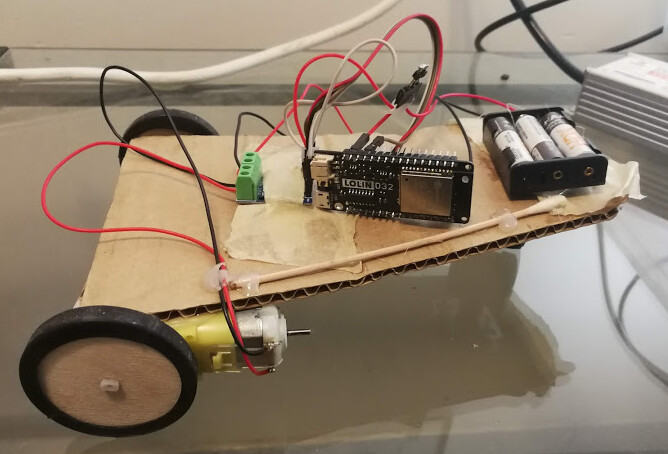

##Tweedracer

A barebones starter platform for remote control cars.

Designed to be built incredibly quickly, and readily hacked upon.

###Firmware

This projects uses the ESP-IDF framework, version 4.4.

####Installation and Usage

- [Follow the official Espressif directions](https://docs.espressif.com/projects/esp-idf/en/stable/esp32/get-started/index.html#installation-step-by-step)
- Download this git repo
- Go to the menuconfig and add in your wifi credentials
- Change the mDNS name in main.c
- Build and flash to your board
- Navigate to http://[yourMDNSname.local] on your phone
- Drag the ball on the screen around to drive