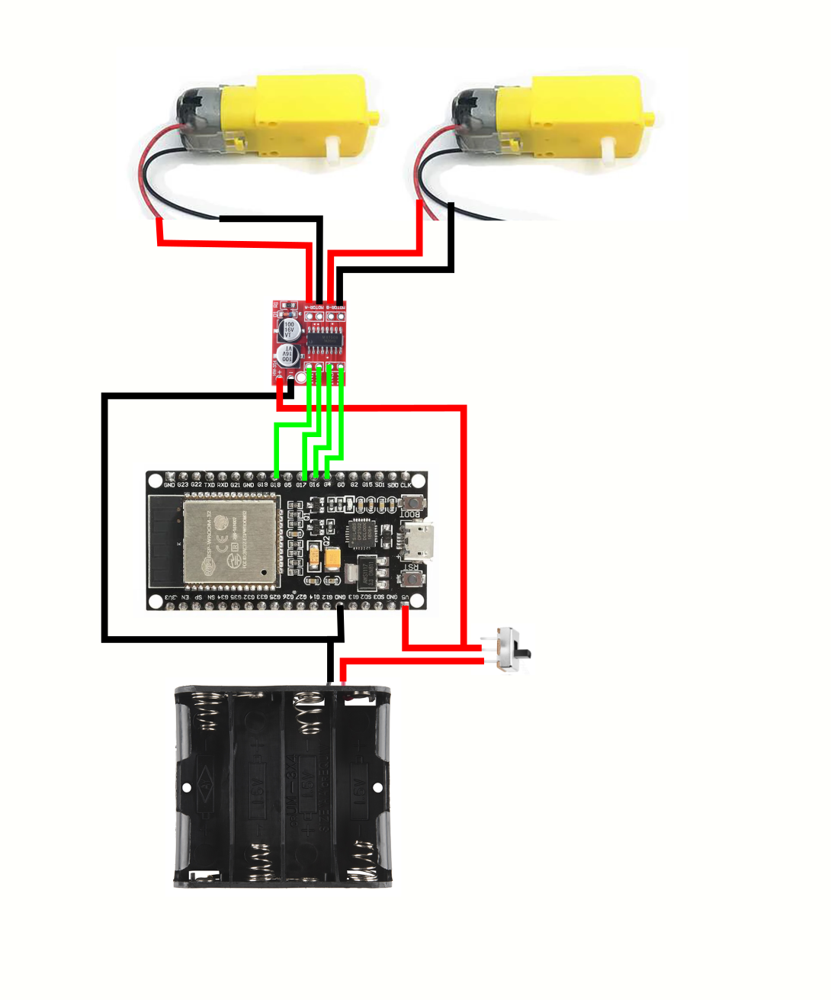

## Tweedracer

A barebones starter platform for remote control cars.

Designed to be built incredibly quickly, and readily hacked upon.

https://user-images.githubusercontent.com/6027644/164622684-72c06576-6b1f-4820-a275-ad31c8ef8cd2.mp4

### Hardware

Wire up all of the components like this:

Basic soldering skills are required, but this is not a challenging build.

### Firmware

This projects uses the ESP-IDF framework, version 4.4.

#### Installation and Usage

- [Follow the official Espressif directions](https://docs.espressif.com/projects/esp-idf/en/stable/esp32/get-started/index.html#installation-step-by-step)
- Download this git repo
- Go to the menuconfig and add in your wifi credentials
- Change the mDNS name in main.c
- Build and flash to your board
- Navigate to http://[yourMDNSname.local] on your phone
- Drag the ball on the screen around to drive
- Do either of the motors seem backwards or flipped? Change the pin assignments in motor.h (LEDC_OUTPUT_LEFT/RIGHT and DIR_OUTPUT_LEFT/RIGHT)
